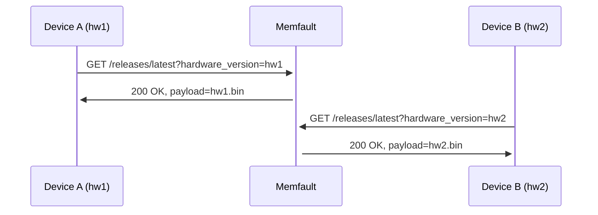

import Tabs from "@theme/Tabs";
import TabItem from "@theme/TabItem";

This guide is intended for users who have already integrated the Memfault SDK
into their firmware and require more complex OTA functionality than the "single
device image" strategy provides.

:::note

This guide should be used in conjunction with the
[Web App -> Over-the-Air Updates (OTA)](docs/platform/ota/) platform guide,
which describes in general how Memfault's OTA system operates.

For standard single-image MCU OTA, please see the guide at
[MCU -> Over-the-Air Updates (OTA)](/docs/mcu/releases-integration-guide).

:::

## Background

## General Considerations

<!--
  - recommend if at all possible to do single monolithic images
  - forwards/backwards compatibility in multi-component systems
  - migrating on-device configs/file systems
 -->

## Hardware Version Specific Payloads

Memfault users can use the
["Hardware Version"](/docs/platform/software-version-hardware-version) specifier
to permit deploying a single OTA Release (eg "1.0.0") to a cohort of devices
with different hardware, where each hardware variant requires a different OTA
payload.

During the OTA HTTP request, the `hardware_version` specifier is used to select
the correct payload for a given device:

The payloads are attached to the release

## Strategies for Multi-Component OTA

<!--
- attributes for subcomponent sw versions
 -->

### Combined Bundle and Manifest

<!-- http range requests, subcomponent version comparison done on-device -->

### Separate Update Payloads Using Software Type

<!-- not sure if this actually works in practice 😢 -->

### Separate Update Payloads Using Memfault Projects

<!-- requires multiple project keys on the requesting client -->

## Strategies for Fallback OTA

<!-- separate project for "factory fresh" image deployments? -->
