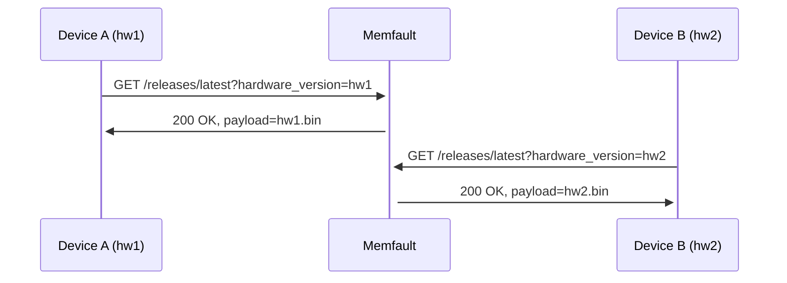
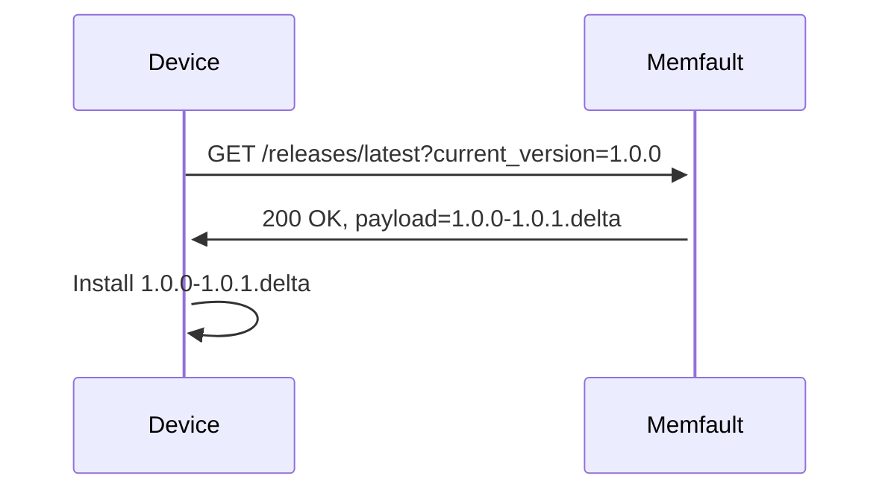

import Tabs from "@theme/Tabs";
import TabItem from "@theme/TabItem";

This guide is intended for users who have already integrated the Memfault SDK
into their firmware and require more complex OTA functionality than the "single
device image" strategy provides.

:::note

This guide should be used in conjunction with the
[Web App -> Over-the-Air Updates (OTA)](docs/platform/ota/) platform guide,
which describes in general how Memfault's OTA system operates.

For standard single-image MCU OTA, please see the guide at
[MCU -> Over-the-Air Updates (OTA)](/docs/mcu/releases-integration-guide).

:::

## Background

Memfault's OTA solution is designed to be flexible enough to support a wide
range of use cases, from simple single-image OTA to complex multi-component OTA.

OTA configuration depends heavily on the device's OTA requirements. For example,
a device with a single MCU and a single image will have different requirements
than a device with multiple MCUs and multiple images, and a device that requires
delta upgrades will have different requirements as well.

The following topics cover some of the more advanced OTA use cases that Memfault
supports.

## OTA & Device Version Specifiers

:::note

More information on Memfault versioning can be found at
[Software Versioning](/docs/platform/software-version-hardware-version).

:::

Here are Memfault's recommendations around versioning:

- Device `software_version` identifiers should use
  [SemVer 2.0](https://semver.org) versioning when possible
- Reported `software_version` should _exactly_ match the OTA Release Version
  name

Note that SemVer 2.0 "build metadata" (`1.0.0+abcd`) is not supported by
default, but needs to be opted into by contacting Memfault Support at
support@memfault.com .

For tying Source Control versions to OTA Releases, Memfault recommends using the
following strategies:

- **Recommended:** use a tag in your Source Control system that matches the OTA
  Release Version name (eg `git tag -a -m=1.0.0`)
- upload the Source Control commit hash as the OTA Release `revision` field (eg
  `git rev-parse HEAD`), either from the Web UI or the Memfault CLI.

<p align="center">
  
</p>

## Downgrading & Backwards Compatibilty

<!--
  - migrating on-device configs/file systems
  -->

<!--
  - recommend if at all possible to do single monolithic images
  - forwards/backwards compatibility in multi-component systems
 -->

## Hardware Version Specific Payloads

Memfault users can use the
["Hardware Version"](/docs/platform/software-version-hardware-version) specifier
to permit deploying a single OTA Release (eg "1.0.0") to a cohort of devices
with different hardware, where each hardware variant requires a different OTA
payload.

During the OTA HTTP request, the `hardware_version` specifier is used to select
the correct payload for a given device:



The payloads are uploaded to Memfault with the matching `hardware_version`
specifier, either via the Web UI or the Memfault CLI:

<p align="center">
  
</p>

```bash
# Example uploading an OTA payload for the "mp" hardware version
$ memfault --org-token $ORG_TOKEN \
           --org acme-inc --project smart-sink \
           upload-ota-payload \
           --hardware-version mp \
           --software-type app-fw \
           --software-version 1.0.1 \
           --revision 89335ffade90ff7697e2ce5238bd4c68978b6d6e \
           build/stm32-fw.bin
```

## Multi-Component OTA

<!--
- attributes for subcomponent sw versions
 -->

### Combined Bundle and Manifest

<!-- http range requests, subcomponent version comparison done on-device -->

### Separate Update Payloads Using Software Type

<!-- not sure if this actually works in practice 😢 -->

### Separate Update Payloads Using Memfault Projects

<!-- requires multiple project keys on the requesting client -->

## Fallback OTA

<!-- separate project for "factory fresh" image deployments? -->

## Delta Firmware Updates

In the context of MCU devices, Delta Firmware Updates can be pre-computed before
uploading to Memfault.

This enables specific OTA paths, for example a Delta Release that upgrades from
`1.0.0` to `1.0.1`:



See more documentation on Delta Release in the
[Platform OTA manual](/docs/platform/ota/#delta-releases)

Memfault recommends that the device support both Delta and Full OTA, in the case
where a Delta payload is not practical.

Due the nature of pre-computed Delta payloads, each release can generate `n`
Delta Releases:

| Release Version | Delta Releases                              |
| --------------- | ------------------------------------------- |
| 1.0.0           | 1.0.0-1.0.1                                 |
| 1.0.1           | 1.0.0-1.0.2<br/>1.0.1-1.0.2                 |
| 1.0.2           | 1.0.0-1.0.3<br/>1.0.1-1.0.3<br/>1.0.2-1.0.3 |
| ...             | ...                                         |

If it's necessary (or desirable) to limit the number of Delta Releases, you can
use Memfault's data on the number of devices on each release to determine which
Delta update paths should be generated:

<p align="center">
  
</p>
For example, only generate Delta Releases for the 5 releases with the most devices,
and apply a Full Release for all devices on less popular releases.
